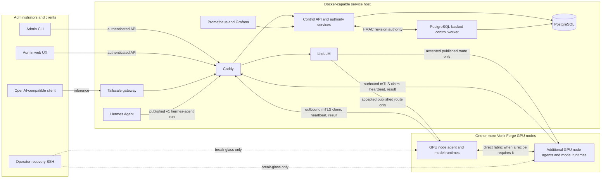

# Vonk Forge architecture overview

Vonk Forge separates the Docker service host from the GPU node compute plane. The
service host can be a NAS or any Docker Compose-capable Linux machine. A cluster
can contain one, two, or more Vonk Forge GPU nodes; no product contract fixes the count or
uses a GPU node hostname or IP address as identity.

Recipe uninstall validates the requested installation's current typed metadata, recipe
identity, and artifact paths, then removes only that installation directory.
It does not scan unrelated installations or require the removed workload to
pass launch admission. Shared distribution objects and other installations'
materialized copies remain intact, including any hard links to the same bytes.
Invalid metadata or inaccessible storage within the requested installation
still rejects removal.

Each GPU node is independently installed and enrolled. Its stable `spk_…` identity
comes from the node key and certificate, while its current management address is
fresh authenticated presence evidence. DHCP reservations are useful operationally
but are never control-plane authority. Local DNS is optional: operators may map
`<NAS_MANAGEMENT_IP>` to `<ENROLLMENT_HOSTNAME>`, `<CONTROLLER_HOSTNAME>`, and
`<REGISTRY_HOSTNAME>` in `/etc/hosts` on the NAS and GPU nodes without changing
the trust model.

## One control contract at every fleet size

There is no fixed fleet size. Every enrolled Spark has one stable `spk_…`
identity backed by its own key and certificate; an IP address is not identity.
The control/runtime contract stays the same as nodes are added:

| Shape | Runtime behavior | Client and control behavior |
| --- | --- | --- |
| **One Spark** | A single-node runtime owns its model endpoint and all local artifacts. No fabric fields are required. | The agent calls `agents.vonk-forge.lan:8443`; after health evidence, the controller publishes one accepted route. |
| **Two Sparks** | A tensor-parallel gang assigns an entrypoint rank and a worker rank on the direct fabric. Only the entrypoint serves the model API. | Both certificate-bound ranks must acknowledge the same run before `mia-deepseek-v4-flash` is published. One stale or failed rank withdraws the whole route. |
| **Many Sparks** | The planner places independent workloads and gangs across compatible nodes. A gang can use any accepted subset; other nodes remain available for other work. | Each node still pulls only its fenced operations. The controller publishes each healthy entrypoint independently; it does not broadcast Docker commands or turn IP addresses into authority. |

For every shape, user inference follows **Tailscale → Caddy → LiteLLM → one
accepted recipe entrypoint**. Caddy knows paths, LiteLLM knows controller-published
aliases, and neither discovers containers. GPU nodes initiate outbound mTLS to
the NAS; they do not run Tailscale, Caddy, LiteLLM, PostgreSQL, or the control
API.

## Trust and control flow

Vonk Forge has an explicit authority split. PostgreSQL is authoritative for the
local platform authority and recipe catalog: topology, fleet policy, package
families, authored and imported revisions, WorkloadRun import reports,
installations, placements, and runs. A published recipe catalog is optional
discovery, never a remote dependency for local execution. TUF remains the
authority for signed platform release artifacts; desired platform topology and
policy are persisted in PostgreSQL.

For the current platform path, the API owns the PostgreSQL authority head,
immutable revisions, persisted proposals, and eligibility policy. The catalog
owns exact model versions, execution harnesses, recipe revisions,
installations, mappings, and runs. Recipe route publication derives LiteLLM
configuration from the accepted v1 run itself; no external repository or
Hermes fallback policy participates. Platform plans remain canonical and
persisted in PostgreSQL with their authority revision, targets, operation graph,
payload digests, routes, protocol range, and plan digest. Catalog plans use a
recipe revision digest as their own content identity.

The worker deliberately has no source checkout, Git credentials, Git/OpenSSH
executable, or GPU node-facing network. It advances durable reconciliations and
publishes atomic, leased route bundles. It obtains current-head and policy
decisions from the API over a dedicated two-party internal network. Those
bounded exchanges are nonce-bound, short-lived, HMAC authenticated, and never
exposed by Caddy.

Routine GPU node work is pull-based. Each GPU node agent opens an outbound mTLS request,
claims only operations for its certificate-bound node identity and compatible
protocol/capabilities, heartbeats a fenced attempt, and returns digest-bound
evidence. The control plane does not open SSH, SCP, or an agent connection to a
GPU node. SSH remains available to trusted administrators for break-glass host maintenance,
fabric recovery, and explicit break-glass inspection.

## Service placement

| Component | Responsibility |
| --- | --- |
| Caddy | Tailnet web/API routing, distinct enrollment and agent SNI boundaries, agent mTLS verification, and denial of internal routes. |
| Control API | Admin API/web backend, PostgreSQL authority and policy, desired-state planning, agent enrollment/claims/results, audit, and metrics. |
| Control worker | Durable reconciliation, dependency waves, compensation, fail-closed withdrawal, and atomic route/LiteLLM publication. |
| PostgreSQL | Jobs, immutable resolved plans, operation/attempt fences, agent identity/presence, reconciliation state, cancellation, and audit evidence. |
| LiteLLM | OpenAI-compatible aliases and quotas generated only from an acknowledged, unexpired publication bundle. |
| Hermes Agent | Persistent tools/UI service that reaches inference only through the Caddy-gated LiteLLM route published by an exact v1 `RecipeRun` named `hermes-agent`. |
| Prometheus/Grafana | Platform, agent, job, route, node-exporter, and DCGM observability. |
| Tailscale | Named remote services without placing remote-access software on GPU nodes. |
| GPU node agent | Non-root outbound control client and the only routine executor of typed node/release/workload operations. |
| GPU node runtimes | Repository-declared model adapters and verified local artifacts; model weights and tensor traffic remain off the service host. |

The Compose project keeps PostgreSQL, agent ingress, revision authority,
registry publication, inference, and Hermes networks separate. Only Caddy
publishes a host port. LiteLLM alone joins GPU node-facing cluster egress; the
worker and API do not.

## Source-first recipe lifecycle

Recipe workloads are built from their own immutable source bundles, not from a
community image registry. A recipe bundle contains one Dockerfile and its
bounded build context; the controller validates the Dockerfile and any Compose
policy, checks fresh builder disk and memory capacity, and queues a typed
`recipe.build.v1` operation. One compatible GPU-node agent performs the
rootless Podman build without a Docker socket, host mounts, devices, secrets, or
privilege, then records the exact OCI image digest and immutable archive
digest. The durable build identity also binds the builder agent's reported
binary SHA-256 and the Docker-archive format. An accepted result therefore
cannot be reused after a builder implementation or export-format change. The
archive output budget follows the largest declared per-node image budget;
diagnostic stdout/stderr remains independently capped. Actual exported sizes
and digests come from the builder receipt.

The Controller compiles build policy when it imports a source Recipe. Authors
do not repeat Podman defaults or security settings in recipe documents. The
rootless build receives up to eight CPU cores, 4,096 tasks, 24 hours, and a
memory budget equal to the declared image budget, bounded between 2 and 64 GiB.
Temporary storage reserves the larger of the declared staging budget and three
times the image budget (capped at 16 TiB), with the separate host disk reserve
and current free-memory admission checks still enforced. These are planning
budgets, not measurements or model-download sizes.

Build steps receive only CHOWN, DAC_OVERRIDE, FOWNER, FSETID, SETFCAP, SETGID,
and SETUID inside the existing rootless user namespace, so package installation
and file ownership operations work. Builds receive no GPU, host mounts, socket,
or privileged mode. The complete Podman option set is compiled centrally;
options and capabilities participate in the immutable image build identity.

Rootless Podman ends at the build/export boundary. Accepted workloads run on
DGX Spark's supported Docker Engine and NVIDIA Container Toolkit. The
unprivileged agent never joins the Docker group or opens the daemon socket;
instead, the controller signs an expiring grant bound to one canonical runtime
request, and a root helper compiles only the allow-listed Docker operation.
The helper verifies the imported image, Linux/ARM64 platform, numeric non-root
user, runtime-interface label, resource limits, mounts, ports, and optional
`--device nvidia.com/gpu=all` request. Bridge mode remains the default. A connected multi-node
recipe may select one compiled direct-fabric shape with host networking, host
IPC, `/dev/infiniband`, and fixed memlock/stack limits; the helper requires the
complete shape plus the host-firewall preflight. It rejects every partial or
additional host privilege, arbitrary devices, privileged containers,
additional capabilities, and socket mounts.

Public builds use a per-build hostname-aware egress boundary. The build joins
only an internal rootless Podman network; a minimal dual-homed proxy sidecar is
the sole member that also joins a fresh outbound network. The proxy accepts
HTTP GET/HEAD and CONNECT only for each exact declared hostname on ports 80 or
443, resolves the name for every connection, rejects the connection if any DNS
answer is private, link-local, metadata, multicast, documentation, or reserved,
and connects only a vetted address. Proxy credentials and hop-by-hop headers
are not forwarded, concurrency/header/transfer/idle limits are bounded, and all
containers, networks, images, and private storage are removed on every terminal
path. `slirp4netns` is never treated as an allowlist. The Controller requires
fresh `recipe.build.egress-proxy.v1` capability evidence before dispatching a
public build, while networkless builds remain `--network=none`.

Installation maps a resolved recipe revision to exact node identities and ranks.
The controller transfers that one verified Docker-loadable archive over the
authenticated agent channel and each target re-verifies it before import, so a
three-node recipe never rebuilds independently on the other two nodes. Model
downloads are independent of recipes: the Controller can fill the NAS model
cache before any runtime image or Spark assignment exists, and recipes reuse
the same content-addressed model files. Published images and local builds both
use Docker-save archives in the shared `image-cache` directory. The original
registry pin remains separate from the exported platform manifest, config ID,
and archive checksum; the Controller inspects the exported config and platform
before use. Docker-save does not retain the original manifest, so its
reconstructed manifest digest is never compared with the builder's original.
Model files live under `/state/model-cache`; image archives live under
`/state/agent-artifacts/image-cache`, shared by the API and worker. Both caches
reuse successful content verification while device, inode, size, timestamps,
ownership, and mode remain unchanged. Changes trigger a new byte scan. The
verification cache is bounded and process-local; authorization is still checked
on every operation. Storage reconciliation reuses unchanged verified files;
changed filesystem identities trigger a new byte scan.
Model weights and other declared artifacts are installed separately, with disk checks before
installation and memory/VRAM, active-workload, and direct-fabric checks before
start. Multi-node v1 uses ordinary TCP over the declared direct-fabric
addresses; it does not claim GPUDirect RDMA support. The resulting workload
route is published to LiteLLM only after every
mapped node has acknowledged the same build and run evidence. The global
catalog, when enabled, stores recipe metadata and source bundles; it does not
store image layers or registry credentials.

The run alias is the stable client-facing model name. A recipe may serve a
different implementation-local model name: the first ordered value in
`runtime.endpoint.model_aliases` is its primary upstream name. Route
publication derives that value from the immutable installed recipe revision
and writes an explicit LiteLLM public-to-upstream mapping. Invalid or missing
runtime model authority withdraws or blocks the route instead of forwarding the
public name blindly.

## External release and future global services

The local control plane is complete without any hosted global service. This
repository's GitHub Actions release workflow builds, tests, signs, and publishes
one versioned platform set: the control images, signed platform manifest, and
matching ARM64 `vonk-forge-agent` Debian package. The optional apt publication
consumes that exact package at `packages.vonkforge.ai`; it is not a Railway job.

The separate `vonk-forge-web` repository is a future global catalog surface. Its
frontend is intended for Cloudflare Pages. Only when the global catalog is
needed should its API, validation worker, and PostgreSQL database be provisioned
on Railway. That hosted catalog publishes immutable metadata for import; it does
not run recipe containers or store model weights. Local PostgreSQL remains
authoritative for installation, placement, admission, and execution.

## Reconciliation and route publication

For a new authority or recipe revision, the control plane follows a durable,
restart-safe sequence:

1. Verify the authority or recipe revision is current and eligible, resolve the exact run plan, and
   persist the immutable plan before mutation.
2. Withdraw the prior route into acknowledged maintenance.
3. Execute stop operations in authority-declared order, then prove every
   affected node has zero active NVIDIA compute processes.
4. Install, prepare, start, health-check, and verify the new workload graph
   through outbound agent operations.
5. Compensate or enter `waiting-for-operator` when mutation outcome is uncertain.
6. Publish routes only after every required result and endpoint-evidence digest
   is accepted, then require an exact LiteLLM supervisor acknowledgement.
7. Renew only while the applicable PostgreSQL authority and catalog revisions,
   agent compatibility, certificate state, authenticated presence,
   and publication lease remain valid. Otherwise withdraw fail closed.

Route generations are staged under immutable digest-named directories and become
active through one atomic marker. LiteLLM mounts the publication volume read-only
and falls back to an empty bootstrap on malformed, unacknowledged, restored,
expired, or withdrawn state.

The shared route activation contract allows 30 seconds to stop and reap the old
LiteLLM child, then 120 seconds for all replacement preparation, startup retries,
and readiness checks. The Controller waits up to 165 seconds for the exact
generation acknowledgement. Each publication has a finite 180-second lease,
capped at 300 seconds after its oldest admitted observation; observations must
be at most 120 seconds old when admitted. This covers the permitted transition
without requiring renewal during the acknowledgement wait. Expiry still denies
serving, and an expired generation cannot restart its startup budget.

## Scaling and networking

Adding a GPU node repeats the same install/enroll operation and adds a stable node
record to the PostgreSQL fleet authority. Placement and operation ordering are
deterministic for one, two, sixteen, or more nodes; sixteen is a tested small-
cluster shape, not a hard product limit.

Tensor-parallel traffic follows the PostgreSQL topology directly between the
selected GPU nodes. It never traverses Caddy, LiteLLM, PostgreSQL, or the service
host. The [node onboarding runbook](runbooks/node-onboarding.md) covers stable
identity and count-independent inventory. Model-version, harness, recipe, and
capacity comparisons live in the [model catalog](operators/model-catalog.md) and
[model capacity overview](model-capacity-overview.md).
